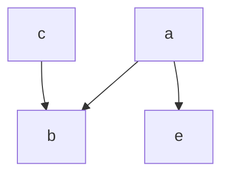
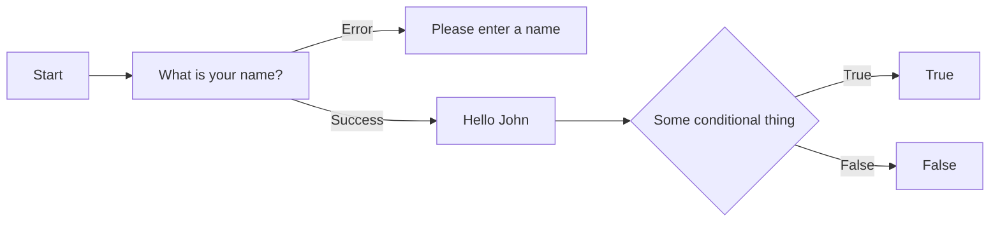

```mermaid
flowchart
    a --> b
    a --> e
    c --> b
```

```mermaid
flowchart LR
    start[Start] --> a[What is your name?]
    a -->|Error| b[Please enter a name]
    a -->|Success| c[Hello John]
    c --> conditional{Some conditional thing}
    conditional -->|True| true[True]
    conditional -->|False | false[False]
```

